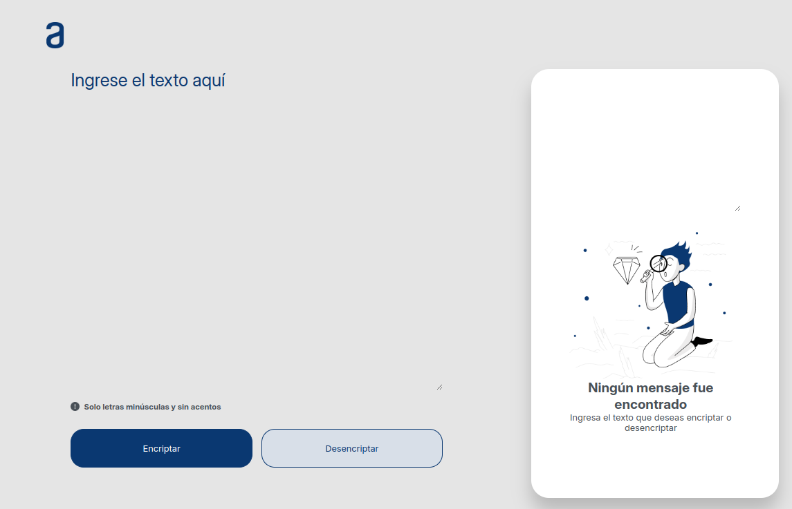

<h1 align="center"> Challenge Alura Encriptador de Texto </h1>

# Descripción

Este proyecto es una herramienta web sencilla que permite encriptar y desencriptar texto utilizando un conjunto de reglas de sustitución. Diseñado para ser intuitivo y fácil de usar, es ideal para aprender conceptos básicos de manipulación de cadenas y criptografía elemental.

## Uso

Para utilizar el encriptador:
1. Ingresa el texto en el área de texto de la izquierda.
2. Presiona el botón de encriptar.
3. El resultado aparecerá en el área de texto de la derecha.

También incluye un botón **'Copiar'** por si necesitas pegar el texto en otro lado o simplemente volver a encriptarlo o desencriptarlo desde el área de ingreso de texto.

Puedes ver una demostración en vivo del proyecto aquí: [Ver en GitHub Pages](https://danielag85.github.io/Challenge/)

## Tecnologías Utilizadas

- **HTML**
- **CSS**
- **JavaScript**

## Contacto

Puedes contactarme en [danielaguilino85@gmail.com](mailto:danielaguilino85@gmail.com).
